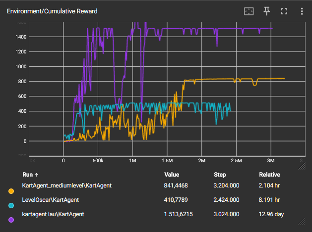

# Virtual Reality Racegame met Machine Learning

## Inleiding

### Overzicht
Dit project betreft de ontwikkeling van een Virtual Reality racegame waarbij spelers het opnemen tegen door machine learning aangestuurde karts. De game biedt een unieke combinatie van real-time VR besturing en AI-gedreven competitie.

### Samenvatting
Na het lezen van deze documentatie heeft de lezer inzicht in de implementatie van machine learning binnen een interactieve VR-omgeving, kennis van AI-prestaties via Tensorboard, en een begrip van mogelijke verbeterpunten voor toekomstige projectontwikkeling.

## Methoden

### Installatie
- **Unity Engine:** Versie 6000.0.3f1
- **Unity ML-Agents:** Versie 2.0. Dit framework maakt het mogelijk om machine learning-technieken toe te passen voor het trainen van de AI-gedreven karts.
- **Anaconda:** Voor het beheren van de machine learning-omgevingen en afhankelijkheden. Dit platform is voor het opzetten van een geïsoleerde omgeving die alle benodigde libraries en frameworks ondersteunt voor het ontwikkelen van je AI-modellen.
- **Meta Quest VR Headset:** Noodzakelijk voor VR-inputverwerking.

### Verloop van het Spel
Spelers besturen een kart in een VR-omgeving en concurreren tegen AI-gestuurde karts die getraind zijn via reinforcement learning. Er zijn drie circuits in totaal.

### Bedieningselementen

Hier is een korte uitleg van de basisbediening voor onze VR-racegame, geoptimaliseerd voor de Meta Quest headset:

- **Sturen**: Gebruik de joystick om de kart naar links of rechts te sturen.
- **Vooruit rijden**: Druk op de hoofdtrigger om de kart te versnellen.
- **Achteruit rijden**: Gebruik de secundaire trigger om de kart te laten remmen of achteruit te rijden.
- **Menu-opties**: Om door het menu te navigeren of selecties te maken, druk je ook op de hoofdtrigger.

### Observaties, Acties en Beloningen

#### Observaties
De AI-agent verzamelt de volgende observaties om beslissingen te maken:
- **Afstand tot de dichtstbijzijnde wall of reward**: Dit helpt de agent te navigeren naar beloningen en vermijden van botsingen.
- **Snelheid van de kart**: Huidige snelheid van de kart die helpt bij het bepalen van de benodigde versnelling of vertraging.
- **Hoek ten opzichte van de baan**: Dit helpt de kart in de juiste richting te sturen afhankelijk van de huidige en gewenste baanoriëntatie.

#### Acties
De agent kan de volgende acties uitvoeren, die directe input zijn voor de kart-controller:
- **Stuurrichting**: Links of rechts. Dit wordt bepaald door de hoek waarin de kart moet draaien om op de baan te blijven of om obstakels te ontwijken.
- **Acceleratie**: Vooruit (versnellen) of achteruit (remmen/achteruit gaan). De mate van versnelling wordt bepaald door de vereiste snelheid om optimale prestaties te bereiken.

#### Beloningen
Het beloningssysteem is ontworpen om de volgende gedragingen te bevorderen:
- **Punten voor het passeren van checkpoints**: De agent krijgt positieve beloningen voor elk checkpoint dat succesvol gepasseerd wordt.
- **Minpunten voor botsingen**: De agent krijgt een straf voor elke botsing met muren of andere obstakels, wat de agent stimuleert om veilig en efficiënt te navigeren.

#### Gedragsimplementatie
##### Acceleratie en Remmen
De kart accelereert of remt afhankelijk van de ontvangen actie-input. Bij acceleratie verhoogt de motor het koppel voorwaarts, en bij remmen wordt het koppel verminderd of negatief om de kart te vertragen.

### Technische Implementatie
De technische implementatie maakt gebruik van Unity's physics engine voor realistische bewegingen en interacties. De AI-acties worden verwerkt via de `PlayerInput` class, die VR-controller input ontvangt, en de dynamiek van de kart wordt beheerd door de `KartController` class, die de fysieke respons van de kart reguleert op basis van deze acties. We hebben de machine learning en AI-technieken in onze scripts gebaseerd op methoden uit een tutorial video (eerste link in de bronvermelding), die essentieel waren voor de ontwikkeling van ons systeem.

## Resultaten

### Training Resultaten
De AI-agents zijn getraind over meerdere simulaties, waarbij hun prestaties via Tensorboard zijn gemonitord.

### Beschrijving van de Grafieken
De grafiek toont de cumulatieve beloningen per agent, waarbij elke kleur een specifieke trainingssessie op een verschillend circuit representeert.

### Opvallende Waarnemingen
De prestaties van de AI-agents variëren aanzienlijk, wat de verschillen in moeilijkheidsgraad van de circuits weerspiegelt:

1. **KartAgent_mediumlevel\KartAgent** (oranje lijn) bereikte een stabiele beloning na een periode van fluctuatie en eindigde met een relatief hoge score.
2. **LevelOscar\KartAgent** (blauwe lijn) vertoonde een meer fluctuerende beloning, wat wijst op een uitdagender trainingsproces.
3. **kartagent_lau\KartAgent** (paarse lijn) stabiliseerde snel, maar vertoonde aanvankelijk significante variabiliteit, wat suggereert dat dit circuit complexer is.

Het verschil in uiteindelijke beloningen is te wijten aan het feit dat de agents allemaal op verschillende circuits zijn getraind. Hierdoor verschilt de hoeveelheid beloningen die men kan verkrijgen per circuit. Deze resultaten suggereren dat verdere optimalisatie nodig is om consistente prestaties over alle circuits te bereiken, met name voor de agents die op moeilijkere circuits zijn getraind.

## Alle Informatie van de One-Pager

### Team en Functies
- **Laurence Leysen:** Focust op AI training binnen het project.
- **Abdulla Bagishev:** Verantwoordelijk voor de documentatie, intro en de main menu.
- **Oscar Alexander:** Leidt de VR implementatie.
- **Mohammed Asad:** Ontwikkelt de assets en het wereldontwerp.

### Spellogica
Het spel start met de speler in een kart, klaar om te racen tegen AI-tegenstanders die voor, achter, links en rechts van de speler kunnen zijn. Het circuit is ontworpen met muren aan de zijkanten om de racebaan duidelijk te markeren en om te voorkomen dat spelers van de baan afrijden.

### Meerwaarde van AI
De AI-tegenstanders zorgen voor constante competitie, waardoor het spel uitdagend en boeiend blijft. Het ontbreken van interactie met andere mensen vermindert de kans op toxisch gedrag, wat bijdraagt aan een aangename spelervaring.

### VR Implementatie
Door gebruik te maken van VR wordt een meeslepende spelervaring gecreëerd die anders is dan traditionele racespellen. Dit verhoogt de betrokkenheid en biedt een nieuwe manier om van racegames te genieten.

## Conclusie

### Samenvatting van Project
In dit project hebben we een VR-racegame ontwikkeld waarin spelers het opnemen tegen karts die worden bestuurd door AI, die we met behulp van machine learning-technieken hebben getraind.

### Overzicht van Resultaten
De resultaten laten zien dat de combinatie van VR en machine learning leidt tot spannende en interactieve game-ervaringen. Ook tonen de verschillende leercurves per circuit het belang aan van zorgvuldige en specifieke training voor de AI.

### Persoonlijke Visie
De resultaten benadrukken de potentie van machine learning om realistische en uitdagende tegenstanders te creëren binnen VR-games. Verdere verfijning kan leiden tot nog meer meeslepende en competitieve VR-ervaringen.

### Toekomstige Verbeteringen
Toekomstige projecten kunnen enorm profiteren van adaptieve leerstrategieën die AI-gedrag nog beter afstemmen op de unieke voorkeuren en acties van spelers. Verder is er ruimte om een geavanceerder model te ontwikkelen dat consistent goede resultaten levert op verschillende circuits. Dit zou wel intensievere training en verfijning van onze methoden vereisen. Een andere spannende mogelijkheid is het verbeteren van de interactie met de speler door over te stappen van traditionele joysticks naar een VR-gebaseerde stuurinrichting. Dit zou spelers de kans geven om een stuur echt vast te pakken en te gebruiken, wat de ervaring zowel realistischer als meeslepender maakt.

## Bronvermelding
- Immersive Tech TV. (2020). **ML-Agents 1.0+ Creating a Mario Kart like AI.** [YouTube](https://www.youtube.com/watch?v=n5rY9ffqryU)
- Valem. (2019). **VR CAR GAME: UNITY VR TUTORIAL FOR BEGINNER.** [YouTube](https://www.youtube.com/watch?v=bWrvUHI9j5U)